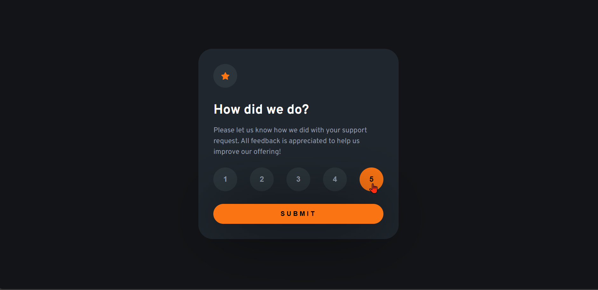
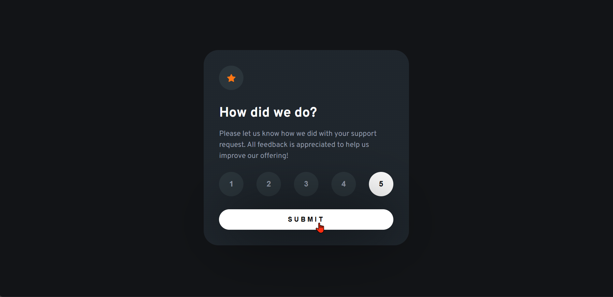
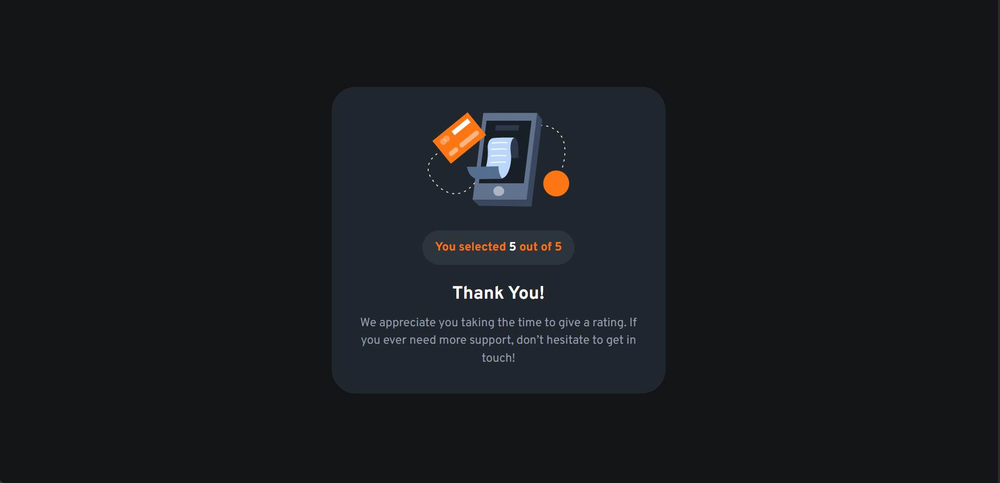
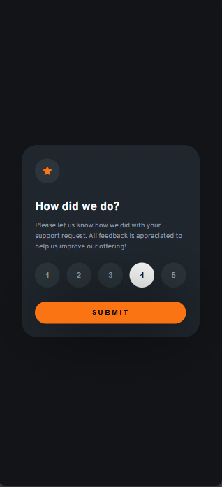
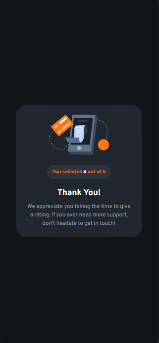

# Frontend Mentor - Interactive rating component solution

This is a solution to the [Interactive rating component challenge on Frontend Mentor](https://www.frontendmentor.io/challenges/interactive-rating-component-koxpeBUmI). Frontend Mentor challenges help you improve your coding skills by building realistic projects.

## Table of contents

- [Frontend Mentor - Interactive rating component solution](#frontend-mentor---interactive-rating-component-solution)
  - [Table of contents](#table-of-contents)
  - [Overview](#overview)
    - [The challenge](#the-challenge)
    - [Screenshot](#screenshot)
    - [Links](#links)
  - [My process](#my-process)
    - [Built with](#built-with)
    - [What I learned](#what-i-learned)
    - [Continued development](#continued-development)
    - [Useful resources](#useful-resources)
  - [Author](#author)

## Overview

### The challenge

Users should be able to:

- View the optimal layout for the app depending on their device's screen size
- See hover states for all interactive elements on the page
- Select and submit a number rating
- See the "Thank you" card state after submitting a rating

### Screenshot







### Links

- Solution URL: [Add solution URL here](https://your-solution-url.com)
- Live Site URL: [Add live site URL here](https://your-live-site-url.com)

## My process

### Built with

- Semantic HTML5 markup
- CSS custom properties
- Flexbox
- CSS Grid
- Mobile-first workflow
- [JavaScript](https://developer.mozilla.org/en-US/docs/Web/JavaScript/)
- [Styled Components](https://styled-components.com/) - For styles

### What I learned

- I learned how to use the clamp() function to build mobile first approach responsive design.
- I learned how to add and hide elements in DOM using JavaScript.

```html
<!-- PARENT/RATING PAGE -->
<section class="parent">
	<article class="parent__content">
		<section class="parent__icon">
			
		</section>
		<section class="parent__title"><h2>How did we do?</h2></section>
		<section class="parent__paragraph">
			Please let us know how we did with your support request. All feedback is
			appreciated to help us improve our offering!
		</section>
		<section class="parent__rating">
			<input
				type="button"
				class="parent__rating-btn parent__rating-btn--1"
				value="1"
			/>
			<input
				type="button"
				class="parent__rating-btn parent__rating-btn--2"
				value="2"
			/>
			<input
				type="button"
				class="parent__rating-btn parent__rating-btn--3"
				value="3"
			/>
			<input
				type="button"
				class="parent__rating-btn parent__rating-btn--4"
				value="4"
			/>
			<input
				type="button"
				class="parent__rating-btn parent__rating-btn--5"
				value="5"
			/>
		</section>
		<input type="submit" class="parent__submit" value="submit" />
	</article>
</section>
```

```css
/* ________MOBILE FIRST APPROACH________ */
.parent,
.feedback {
	display: flex;
	flex-direction: column;
	justify-content: space-between;

	width: 100%;
	/* changed */
	max-width: 340px;
	padding: clamp(1.8rem, 5vw, 2rem);
	border-radius: 2em;
	background: linear-gradient(var(--grey900));
	margin-inline: 0;
}

.parent__paragraph,
.feedback__paragraph {
	line-height: 1.5;
}

.parent__title > h2 {
	color: var(--white);

	margin: 0.5em 0;
}

.parent__title {
	padding-block: 0;
}
.parent__paragraph {
	padding-block-end: 6px;
	color: var(--grey500);
	font-weight: var(--fw400);
	font-size: 0.875rem;
	line-height: 1.5;
}
.parent__rating {
	display: flex;
	justify-content: space-between;
	margin-block-start: 1em;
	gap: 0.5rem;
}
```

```js
/*______CHANGE BUTTON AND BUTTON TEXT COLOR______*/
selectRating.forEach((btn) => {
	btn.addEventListener("click", () => {
		userRating(btn);
		btn.style.color = "hsl(216, 12%, 8%)";
	});
});

/*______DISPLAY FEEDBACK______*/
submitFeedback.addEventListener("click", () => {
	if (selectedValue) {
		feedback.classList.remove("hidden");
		canvas.classList.add("hidden");
	} else {
		alert("Please select a rating first!");
	}
});
```

### Continued development

- I need to revists some basic concepts in Javascript to better implement Javascript logic.
- mobile first approach in for responsive layout.

### Useful resources

- [YouTube@silktide](https://youtu.be/5H1JGdqLrWo?si=0cbGRaV5YTdrkK1h) This helped me better understand how to apply wcag color constrast to a webpage.
- [MDN-DOCS Javascript:forEach()](https://developer.mozilla.org/en-US/docs/Web/JavaScript/Reference/Global_Objects/Array/forEach) This has helped me learn how to use forEach loop in JavaScript and how to use it to loop through items in an array.

## Author

- Frontend Mentor - [@jidoG8](https://www.frontendmentor.io/profile/jidoG8)
- Twitter - [@OjjaC1253](https://x.com/OjjaC1253)
- LinkedIn - [@ojja-caesar](https://www.linkedin.com/in/ojja-caesar-134980345/)
